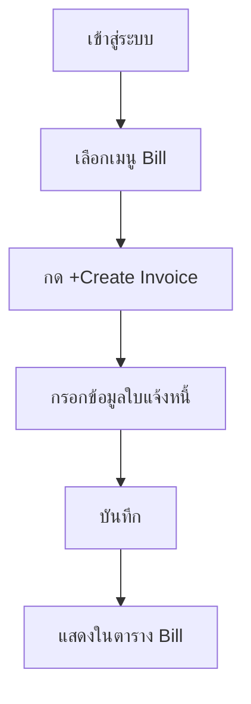
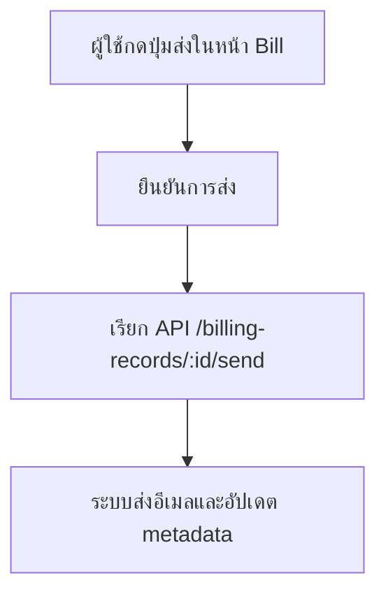
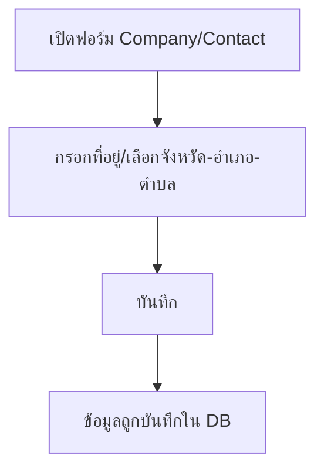

# แผนภาพ Workflow (ลำดับขั้นตอนการทำงาน)

## 1. การสร้างใบแจ้งหนี้ (Create Billing)



## 2. การแจ้งเตือนอัตโนมัติ (Scheduler)

```mermaid
flowchart TD
    S1[Scheduler เริ่มทำงาน (cron)] --> S2[ดึง billing records ที่ถึงกำหนด]
    S2 --> S3[ตรวจสอบ lastNotifiedDate]
    S3 -->|ยังไม่แจ้งวันนี้| S4[ส่งอีเมล]
    S4 --> S5[อัปเดต lastNotifiedDate, notificationsSentCount]
    S3 -->|แจ้งแล้ววันนี้| S6[ข้าม]
```

## 3. การส่งอีเมลแบบ Manual



## 4. การจัดการที่อยู่บริษัท/ผู้ติดต่อ



---

*หมายเหตุ: สามารถเปิดดูแผนภาพ Mermaid ได้ใน VS Code หรือแปลงเป็น PNG ได้ภายหลัง*